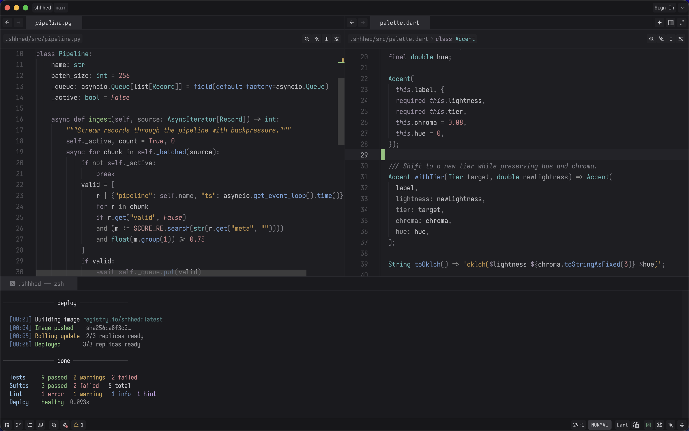

  

# shhhed

A dark theme for [Zed](https://zed.dev) that doesn't fight for your attention.

Most dark themes are designed to be seen, not used. This one is built for the other thing — easy to scan, pleasant to look at, where the structure of the code comes through instead of the syntax around it.

## Design

Colors are assigned to five brightness levels based on how much they matter to reading:

| Plane | OKLCH L | Examples | Role |
|-------|---------|----------|------|
| Canvas | — | Editor  `#1e1e22`, chrome  `#1a1a1e` | Disappears |
| Recede | 0.50–0.56 | Comments  `#757578`, Punctuation  `#6c6c70` | You know it's there, you don't read it |
| Structural | 0.60–0.62 | Operators  `#878787`, Keywords  `#8d8196`, Attributes  `#7a8a7a` | Scaffolding |
| Semantic | 0.67–0.71 | Types  `#60b1b1`, Functions  `#729bcf`, Strings  `#bc8f48`, Numbers  `#ca8489` | The meaning layer |
| Reading | 0.76–0.82 | Variables  `#b8b8bc`, Definitions  `#8bc37b` | What you're actually reading |

Properties and parameters (`property`, `variable.parameter`, `variable.special`) form a gradient between Structural and Semantic (L 0.64–0.66) — they carry some meaning but aren't the primary reading target.

- **Near-neutral canvas** — editor `#1e1e22`, chrome `#1a1a1e`, near-neutral with imperceptible blue depth. Works cleanly with Night Shift and f.lux.
- **OKLCH-computed palette** — every accent color was computed in [OKLCH](https://oklch.com), a perceptually uniform color space. Accents at the same brightness level are told apart by hue, not by one being louder.
- **Moderate saturation** — accents stay under 50% HSL saturation (four of six under 40%). High saturation on dark backgrounds makes colors look brighter than they are and adds strain over long sessions.
- **APCA contrast targets** — contrast is based on the [APCA algorithm](https://git.apcacontrast.com/documentation/APCA_in_a_Nutshell.html) (WCAG 3 draft), which is perceptually accurate for dark themes. Reading-plane text targets Lc 75–90, semantic accents sit at Lc 55–70.

## UI coverage

Covers the full Zed UI surface, not just syntax highlighting.

- **Git gutter & diffs** — added/modified/deleted indicators, word-level diff highlighting, merge conflict markers (ours vs theirs)
- **Search** — passive matches are subtle, the active match stands out
- **Debugger** — active line highlight and accent color
- **Minimap & scrollbar** — three-state thumb (idle, hover, active), all neutral
- **Terminal** — full 16-color ANSI palette with bright and dim variants
- **Status colors** — green for success, amber for warnings, orange for conflicts, rose for errors

## Palette

| Token | Color | Hex |
|-------|-------|-----|
| Types |  | `#60b1b1` |
| Definitions |  | `#8bc37b` |
| Functions |  | `#729bcf` |
| Strings |  | `#bc8f48` |
| Numbers |  | `#ca8489` |
| Keywords |  | `#8d8196` |
| Background |  | `#1e1e22` |

## Further reading

- [APCA Contrast Algorithm](https://git.apcacontrast.com/documentation/APCA_in_a_Nutshell.html) — W3C WCAG 3 working draft
- [OKLCH Color Space](https://oklch.com) — perceptually uniform lightness
- [Helmholtz–Kohlrausch effect](https://en.wikipedia.org/wiki/Helmholtz%E2%80%93Kohlrausch_effect) — why high saturation on dark backgrounds causes perceived brightness spikes
- [Display Color Mode and Visual Fatigue](https://ieeexplore.ieee.org/document/9363189/) — IEEE Access, 2021
- [Effect of Text Color on Visual Fatigue](https://pmc.ncbi.nlm.nih.gov/articles/PMC11175232/) — PMC, 2024
- [Blue Light and Ocular Hazards](https://pmc.ncbi.nlm.nih.gov/articles/PMC9938358/) — PMC, 2023
- [Solarized](https://en.wikipedia.org/wiki/Solarized_(color_scheme)) — prior art for computed palettes using CIELab
- [Syntax Highlighting Done Right](https://tonsky.me/blog/syntax-highlighting/) — Tonsky, cognitive load analysis for syntax coloring

## Install

[shhhed](https://zed.dev/extensions/shhhed-theme) in Zed extensions.

## License

MIT
